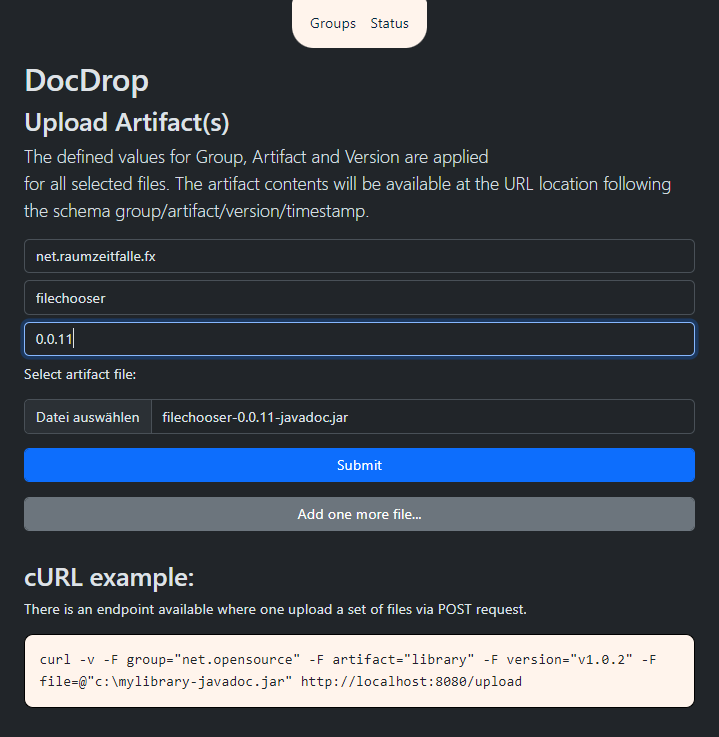
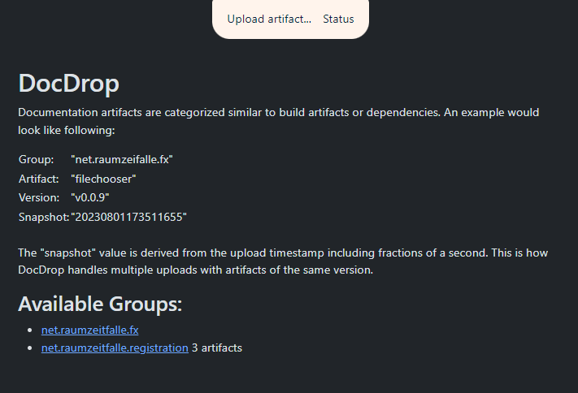
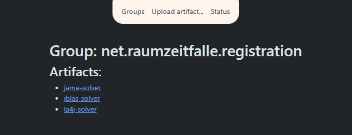
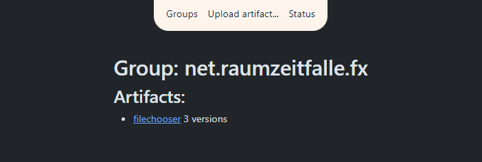
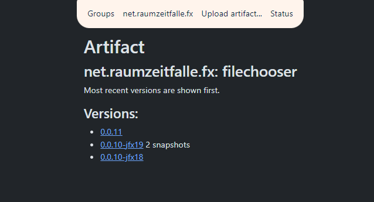
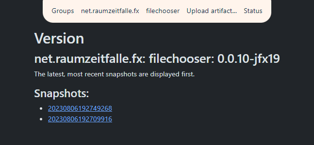
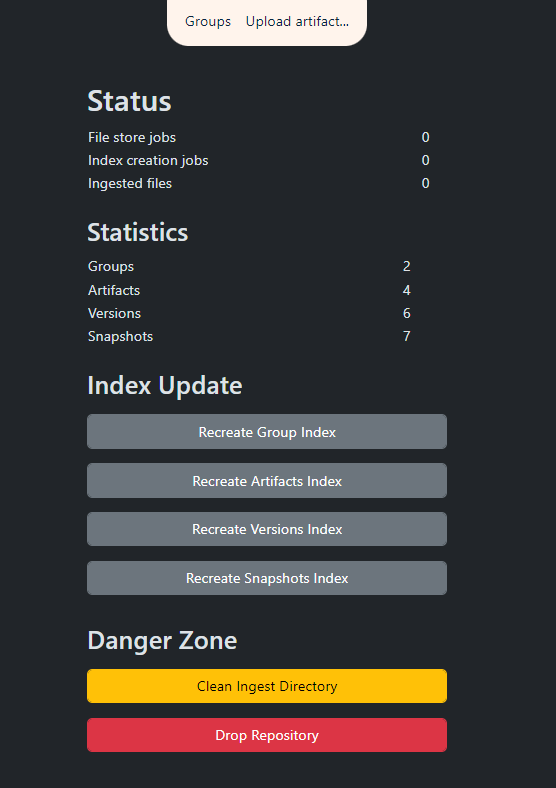

# docbox

## Sharing documentation artifacts from CI/CD

## Concept:

* Artifacts are structured by group name, artifact name, artifact version and snapshot
* `-javadoc.jar`, `.zip`, `.tar` and `.tar.gz` files are accepted
* Each artifact will be accessible via unique URL like `http://localhost/artifacts/group/artifact/version/snapshot/`
* There is a generic shortcut URL for the latest version of each artifact: `http://localhost/artifacts/group/artifact/version/latest/`
* There are index pages:
    * Group index: lists all artifacts within a group
    * Artifact index: lists all versions of an artifact within a group
    * Version index: lists all snapshots of a particular artifact version
    * An upload page: http://localhost:8080/upload.html
    * A status page: http://localhost:8080/status.html

## Setup:

* Artifacts are supposed to be served by an Apache httpd server (port 80) which respects created `.htaccess` files.
* A Quarkus web app running on port 8080 allows uploads and basic maintenance via `status.html` and `upload.html`
* The `upload.html` also describes how to publish artifacts via cURL.

## Backend

* There is no database.
* Quarkus uses either `7za.exe` on Windows or `unzip` and `tar` on Linux.
* Its all not yet tested on MacOS or other systems.
* 7Zip Extra for Windows: https://www.7-zip.org/a/7z2301-extra.7z

## Configuration

* The application is configured using Quarkus `application.properties`. Some properties can be modified using environment variables.

Following environment variables are available:

| Env Variable Name                 | Values                                    | Description |
|-----------------------------------|-------------------------------------------|-------------|
| `DOCBOX_REPOSITORY_ACTIONS_DROP` | `YES`,`NO`                                | When configured with `YES`, the status page will allow repository deletion. |
| `DOCBOX_HOSTURL`                 | `http://localhost`, `http://yourhostname` | There must be no port number. Just have the protocol and your hostname there. The value is used to create the URLs in the static index pages. |
| `APACHE_HTTPD_PORT`               | `80`, `8080`, any port you assign         | Inside Docker container the Apache HTTPD always runs on port 80. Outside the Docker container it might be another port. Configure this specific port here. The value is used to create the URLs in the static index pages. |
| `TEMP`                            | `/var/log`                                | The application logfiles will be placed into `${TEMP}/docbox/docbox.log`. Change this variable to place the application logs at a different location. |

Following options exist:

| Configuration key                   | Description                                     | Example     |
|-------------------------------------|-------------------------------------------------|-------------|
| `apache.httpd.port`                 | See env. var: `APACHE_HTTPD_PORT`               |             |
| `docbox.host.url`                  | See env. var: `DOCBOX_HOSTURL`                 |             |
| `docbox.application.name`          | Application name in all generated html files.   | DocDrop     |
| `docbox.repository.name`           | Name of the repositor.                          | DocDrop     |
| `docbox.repository.index.file`     | Name of directory index files.                  | index.html  |
| `docbox.repository.actions.drop`   | See env. var: `DOCBOX_REPOSITORY_ACTIONS_DROP` |             | 
| `docbox.css.bootstrap.dist.url`    | full URL of `bootstrap.css`                     |             |
| `docbox.css.url`                   | DocDrop custom CSS: `docbox.css`               |             |
| `docbox.views.artifacts.index.url` | Artifact index root URL                         | http://localhost/artifacts        |
| `docbox.views.upload.url`          | Location of upload.html                         | http://localhost:8080/upload.html |
| `docbox.views.status.url`          | Location of status.html                         | http://localhost:8080/status.html |
| `docbox.artifact.storage.location` | Volume for artifact storage                     | `C:\Temp`         |
| `docbox.commands.7z.location`      | 7za Executable                                  | `C:\Test\7za.exe` |
| `docbox.commands.tar.location`     | TAR Executable                                  | `/usr/bin/tar`    |
| `docbox.commands.unzip.location`   | UNZIP Executable                                | `/usr/bin/unzip`  |

## Running DocDrop

**_Prerequisite_**:

* Apache httpd must be running and serving contents of `docbox.artifact.storage.location`

The Docker image usually takes care of this. When running the application without Docker there must be another program running to serve the static files. All received documentation packages are expected to consist of static pages (may be with some statically served JavaScript included, but not more). 

Starting the Web App:
* Change into project directory and run `./mvnw compile quarkus:dev`
* Quarkus is configured so that it also serves from within a Docker container.
* The developer UI is also available:  http://localhost:8080/q/dev/

> **_NOTE:_**  Quarkus now ships with a Dev UI, which is available in dev mode only at http://localhost:8080/q/dev/.

There is now a first Docker image available. The Dev UI is not available from Docker served contents. 

```shell
docker pull raumzeitfalle/docbox:0.5
docker run -it --name docbox -p 80:80  -d raumzeitfalle/docbox:0.5
```

In some cases, when port 80 is already occupied, one can configure the underlying HTTPD to use another port. Also Quarkus must be aware of the new port:

```shell
<<<<<<< HEAD
docker pull raumzeitfalle/docbox:0.5
docker run -it --name docbox -p 8080:80 -e APACHE_HTTPD_PORT="8080" -e DOCBOX_HOSTURL="http://myhostname" -d raumzeitfalle/docbox:0.5
```

It is now also possible to expose the collected artifacts and the logfiles. The following example applies to Windows:

```shell
docker run -it ^
--name docbox ^
-p 8080:80 ^
-e APACHE_HTTPD_PORT="8080" ^
-e DOCBOX_HOSTURL=http://localhost ^
-e DOCBOX_REPOSITORY_ACTIONS_DROP="YES" ^
-v C:\Temp\docbox\artifacts:/var/www/html/artifacts/ ^
-v C:\Temp\docbox\ingest:/var/www/html/ingest/ ^
-v C:\Temp\docbox\logs:/var/log/docbox/ ^
-v C:\Temp\docbox\logs_httpd:/var/log/httpd/ ^
-d raumzeitfalle/docbox:0.5
```

For Linux it would look like:

```shell
docker run -it \
--name docbox \
-p 8080:80 \
-e APACHE_HTTPD_PORT="8080" \
-e DOCBOX_HOSTURL=http://localhost \
-e DOCBOX_REPOSITORY_ACTIONS_DROP="YES" \
-v C:\Temp\docbox\artifacts:/var/www/html/artifacts/ \
-v C:\Temp\docbox\ingest:/var/www/html/ingest/ \
-v C:\Temp\docbox\logs:/var/log/docbox/ \
-v C:\Temp\docbox\logs_httpd:/var/log/httpd/ \
-d raumzeitfalle/docbox:0.5
```

## Screenshots

### Uploading Artifacts


### Group Index



### Artifact Index





### Version Index



### Index by Snapshot



### Status and Maintenance



### Video

Conveniently host Docdrop as a container and publish your own documentation artifacts either via HTML form or via POST request using cURL. Supports `.zip`, `.tar`, `.tar.gz` and `-javadoc.jar`.
Boundary condition: the artifacts shoul have an `index.html` in their root otherwise the httpd would not know what to show. The case that all relevant contents is archived in one sub directory is handled by creating a meta tag based forward when detected.

```shell
curl -v -F group="net.opensource" \
        -F artifact="library" \
        -F version="v1.0.2" \
        -F file=@"c:\mylibrary-javadoc.jar" \
        http://localhost:8080/upload
```

https://github.com/Oliver-Loeffler/docbox/assets/22102800/1e221ef2-dc91-4c2b-a7b7-f1bea0108cc7

## Packaging the application

The application can be packaged using:
```shell script
./mvnw package
```
It produces the `quarkus-run.jar` file in the `target/quarkus-app/` directory.
Be aware that it’s not an _über-jar_ as the dependencies are copied into the `target/quarkus-app/lib/` directory. And it requires to have the correct `application.properties` file placed into the resources directory.

The application is now runnable using `java -jar target/quarkus-app/quarkus-run.jar`.

If you want to build an _über-jar_, execute the following command:
```shell script
./mvnw package -Dquarkus.package.type=uber-jar
```

The application, packaged as an _über-jar_, is now runnable using `java -jar target/*-runner.jar`.

## Creating a native executable

You can create a native executable using: 
```shell script
./mvnw package -Pnative
```

Or, if you don't have GraalVM installed, you can run the native executable build in a container using: 
```shell script
./mvnw package -Pnative -Dquarkus.native.container-build=true
```

You can then execute your native executable with: `./target/docbox-1.0.0-SNAPSHOT-runner`

If you want to learn more about building native executables, please consult https://quarkus.io/guides/maven-tooling.

## Related Guides

- RESTEasy Classic Multipart ([guide](https://quarkus.io/guides/rest-json#multipart-support)): Multipart support for RESTEasy Classic
- RESTEasy Classic ([guide](https://quarkus.io/guides/resteasy)): REST endpoint framework implementing Jakarta REST and more

### RESTEasy JAX-RS

Easily start your RESTful Web Services

[Related guide section...](https://quarkus.io/guides/getting-started#the-jax-rs-resources)

## Attributions

The very nice Fork-Me-At-Github ribbon is made by: Simon Whitaker

https://simonwhitaker.github.io/github-fork-ribbon-css/
